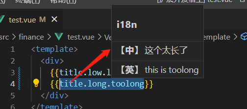
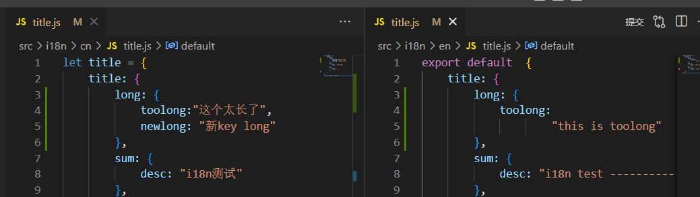

# rapid-tools 说明文档

## 项目快速启动能力

### 1、在package.json中配置指令
```
"rapidMenus": {
    "startup": "xxx1 && xxx2"
}
或者
"rapidMenus": {
	"startup": {
        "script": "dev && test",
        "watch": {
            "link_script": "dev",
            "files": ["./test.js"]
        }
    }
}
```
### 2、在左侧视图栏右键选择“启动”操作


### 3、启动提醒


### 4、自动监听文件内容变更重启脚本
监听到./test.js内容变更，自动重启dev服务。


## 国际化配置查看能力

### 1、在package.json中配置国际化配置文件相关路径
```
"i18nConfig": {
    "validPath": "**/src/**",
    "cnPath": "src/i18n/cn",
    "enPath": "src/i18n/en"
},
```

### 2、鼠标悬停在国际化配置使用处
鼠标悬停上方时，展示处气泡，并在气泡中展示出详细配置。


对应的详细配置如下：
