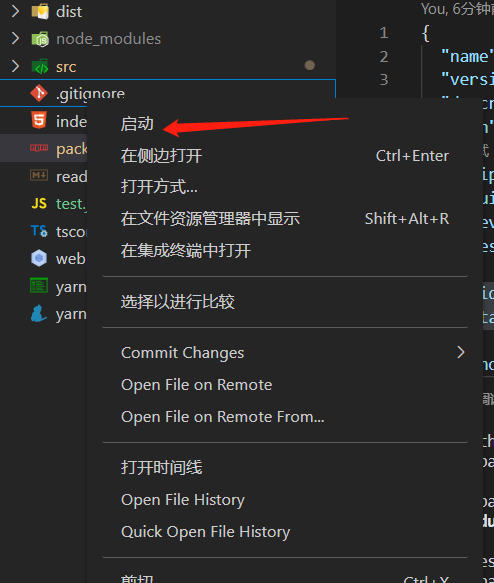
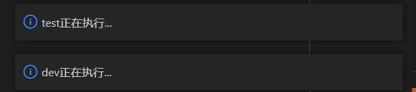

# harri-tools README
## 1、在package.json中配置指令
```
"rapidMenus": {
    "startup": "xxx1 && xxx2"
}
或者
"rapidMenus": {
	"startup": {
        "script": "dev && test",
        "watch": {
            "link_script": "dev",
            "files": ["./test.js"]
        }
    }
}
```
## 2、在左侧视图栏右键选择“启动”操作
;

## 3、启动提醒
;
